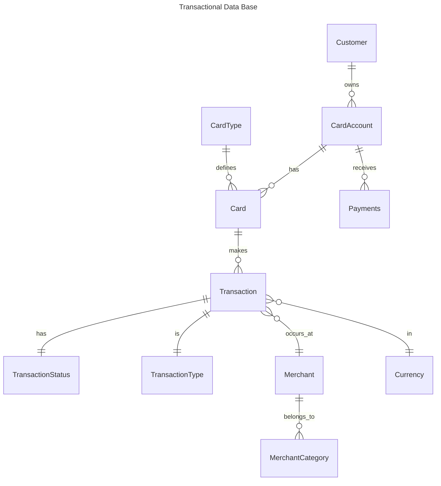

|Table Name	        |Description|
|--                 |--|
|Customer	        |Stores information about the cardholder, such as name, contact, and demographics.|
|CardAccount	    |Represents the financial account linked to a customer; holds balance and limits.|
|CardType	        |Defines card categories (e.g., Visa, MasterCard, Amex, Debit, Credit).|
|Card	            |Stores individual cards issued to customers, linked to CardAccount and CardType.|
|Transaction	    |Records financial operations performed with cards (purchases, withdrawals, etc.).|
|TransactionStatus	|Defines possible states of a transaction (Pending, Approved, Declined, Settled).|
|TransactionType	|Classifies transaction nature (Purchase, Refund, Fee, Cash Advance, etc.).|
|MerchantCategory	|Groups merchants by industry (Retail, Travel, Food, Services, etc.).|
|Merchant	        |Stores merchant details where transactions take place, linked to MerchantCategory.|
|Currency	        |Stores supported currencies (USD, EUR, CHF, etc.) for multi-currency transactions.|
|Payments	        |Records payments made by customers to settle CardAccount balances.|

